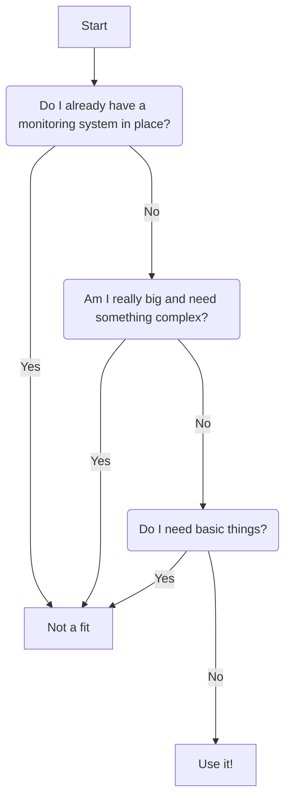

# Frequently Asked Questions

## Should I use CloudWedge?

Here are a few questions to get a feel for what you should do.

```mermaid
flowchart TD
    A[Start] --> B(Do I already have a monitoring system in place?);
    B -- Yes --> Z[Not a fit];
    B -- No ----> C(Am I really big and need something complex?);
    C -- Yes --> Z[Not a fit];
    C -- No ----> D(Do I need basic things?);
    D -- Yes --> Z[Not a fit];
    D -- No ----> ZZ[Use it!];
```
